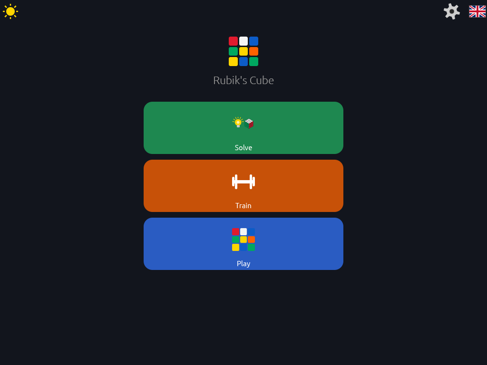
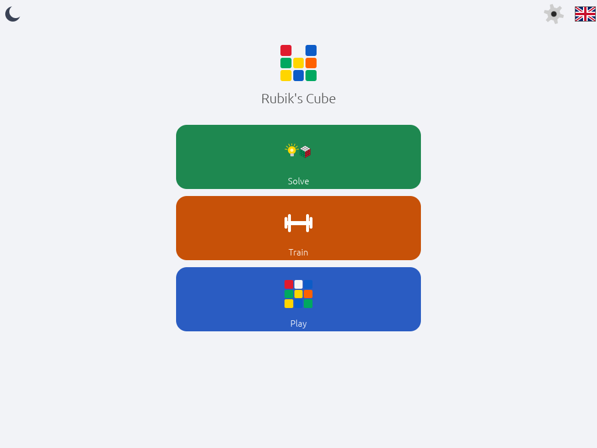
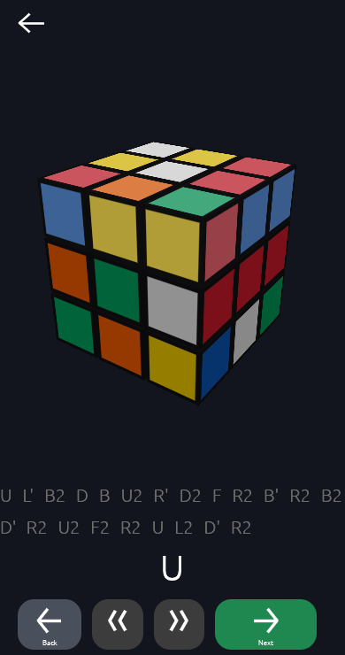
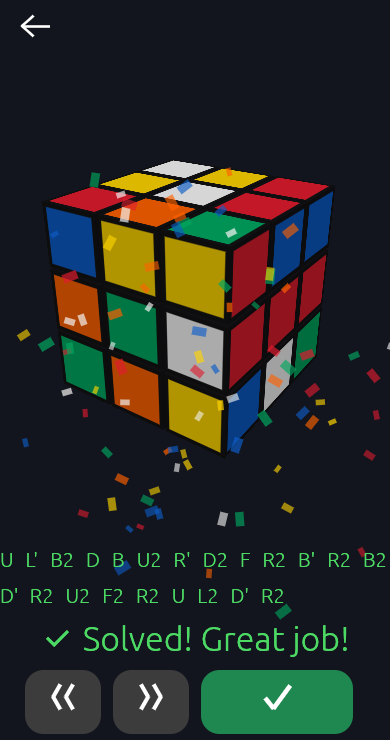
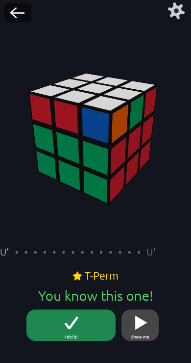
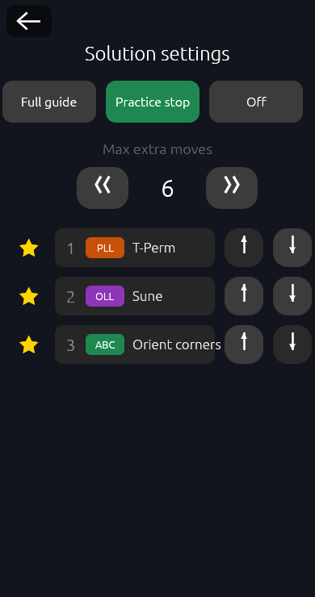
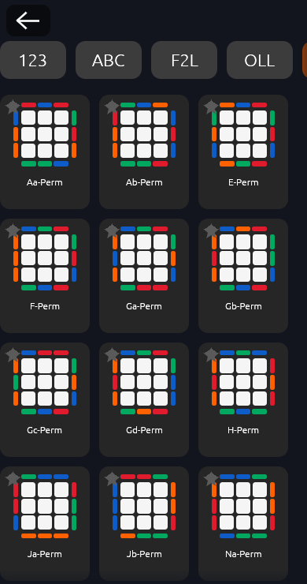
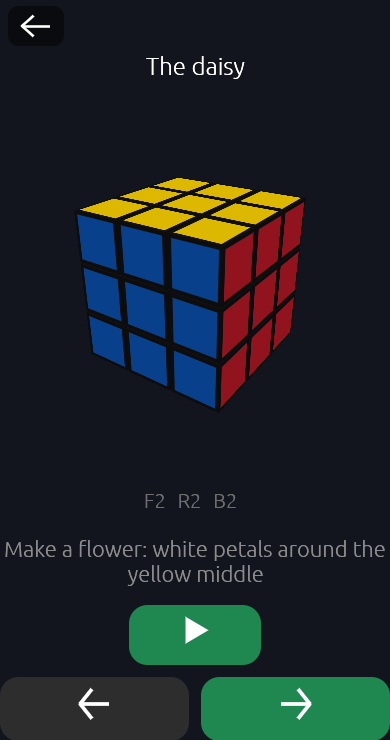
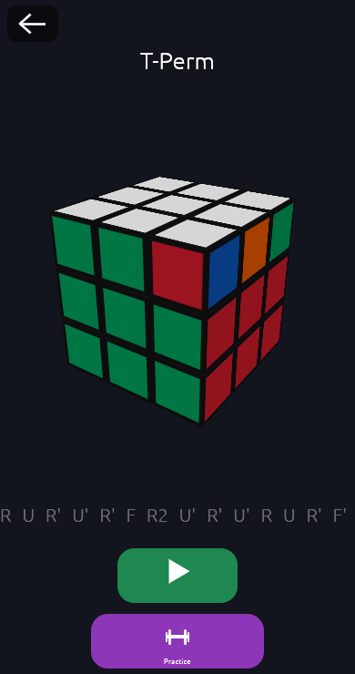
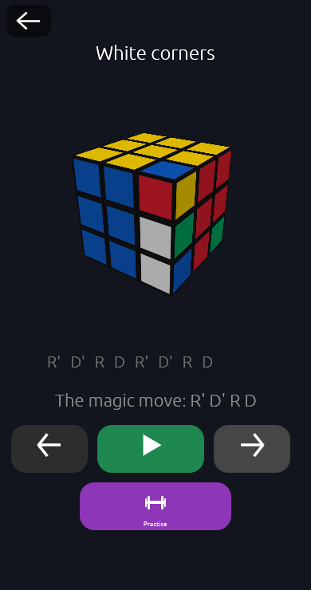

# MPErubiks — Rubik's cube solver & trainer

A visual-first Rubik's cube app in Rust, running in the browser via
WebAssembly (GPU-rendered with wgpu): **scan your real cube with the
camera**, watch it in 3D, and follow a step-by-step guide — then train the
standard algorithm sets with a timer and per-algorithm scores. Once you know
an algorithm, the solver *prefers solutions that use it* and can even stop
there so you execute it from memory.

Designed so children who can't read yet can use it: big colored buttons,
painter-drawn icons, animations and color cues carry the meaning; text is
always secondary. English/Norwegian with a flag switch, dark/light theme.

## Screenshots

All images are the app's **live screenshot tests**
(`crates/cube-app/tests/snapshots/`) — they regenerate with the code, so
this is what the app looks like right now.

| Menu (dark / light) | Solve guide | Solved! |
|---|---|---|
|   |  |  |

| Practice-stop | Settings | Training cards |
|---|---|---|
|  |  |  |

| Lesson player | Algorithm demo | Practice unlocked |
|---|---|---|
|  |  |  |

## Features

- 📷 **Camera scanning** — auto-aligning grid (position *and* scale), per-pixel
  Oklab hue voting, evidence averaged over a hold-steady window, and a
  backtracking **constraint resolver** that fills uncertain cells using the
  cube's hard rules (9 per color, every piece once, solvability). The result
  is rotated + relabeled so every color sits on its standard face.
- 🧭 **Solve guide** — near-instant solutions (≤23 moves; a shallow pre-pass
  returns truly short ones for nearly-solved cubes), stepped one move at a
  time with karaoke notation, two-stage double turns, and a confetti cannon.
- ⚙️ **Practice-stop mode** — the guide halts where a chosen algorithm
  applies, shows only its name ("★ T-Perm — you know this one!"), and you
  execute it from memory; "I did it" fast-forwards, "Show me" reveals.
- 🎓 **Lessons** — beginner steps (daisy → cross → corners → second layer →
  top) with a steppable demo player and Practice buttons into the drill loop.
- 💪 **Training** — PLL · OLL · F2L · beginner cards with demo player, drill
  timer, success/fail stats and a persistent trained-set (MPEdb).

See [INNOVATIONS.md](INNOVATIONS.md) for what this repo invented, borrowed,
and moved somewhere unusual — including the measured negative results.

## Layout

| crate | what |
|---|---|
| `cube-core` | dependency-free cube model: 54-facelet state, moves derived from integer sticker geometry, notation parser, case recognizer (patterns derived from algorithm inverses) |
| `cube-solver` | kewb (Kociemba two-phase) integration, scan constraint resolver, hint/guided-solution engine, packed-table codec |
| `cube-vision` | dependency-free Oklab color voting, grid auto-fit, field-data eval harness |
| `cube-render` | wgpu: instanced cubies, procedural sticker shader, move animation, offscreen depth + blit into egui, tap picking |
| `cube-store` | MPEdb storage (file+WAL native, in-memory + localStorage dump on wasm) |
| `cube-app` | eframe/egui app: menu, play, scan, solve guide, trainer, lessons, settings |
| `xtask` | `gen-table`, `pack-table`, benchmarks |

`assets/algorithms.json` holds 127 validated cases — every algorithm is
checked mechanically (its inverse must produce a state of the claimed kind,
and no two cases may be AUF-indistinguishable), so data errors fail the
build. `assets/table.pack` is the solver table the app ships: nibble-packed
pruning depths + route-compressed move tables (per-column deltas along the
coordinate order — the enumeration is already the optimal "route") +
per-section deflate — 0.9 MB instead of 6.8 MB (13 %), unpacking in ~15 ms.

## Targets & build

- **Web (primary):** `trunk serve` → WebGPU with automatic WebGL2 fallback.
  Camera scanning needs HTTPS or localhost (`trunk serve --tls` for phones).
- **Native desktop:** `cargo run -p cube-app` (same UI, manual cube entry
  instead of camera).

```sh
cargo run -p xtask -- gen-table     # once: generates assets/table.bin
cargo run -p xtask -- pack-table    # packs it into assets/table.pack
trunk serve                         # browser dev build
```

## Tests

```sh
cargo test --workspace                   # core properties, recognizer, vision, solver, store
cargo test -p cube-solver -- --ignored   # 1000 random solves within the bound
UPDATE_SNAPSHOTS=true cargo test -p cube-app --test screenshots  # headless UI PNGs
RUBIKS_SCANS_DIR=... cargo test -p cube-vision --test eval_scans # field eval (dataset outside the repo)
```

The screenshot suite renders real app screens through wgpu (lavapipe works)
into `crates/cube-app/tests/snapshots/`. Scan telemetry (cell crops) uploads
to a private dev server for offline tuning; personal photos are **never**
committed to this repo.
